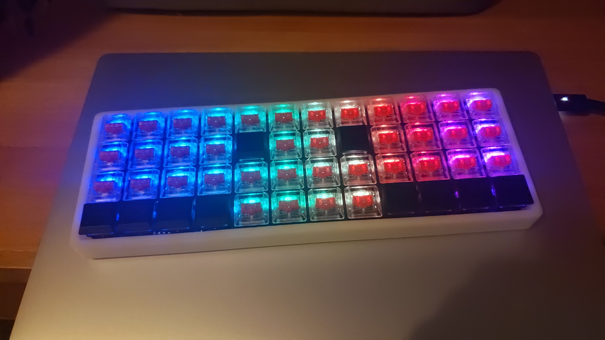
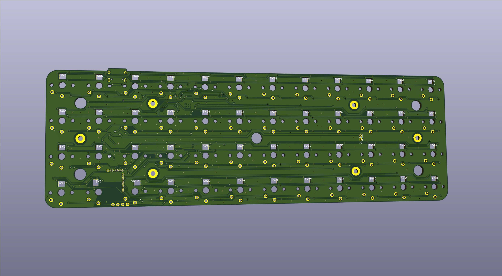

&emsp;&emsp;几个月前我自己动手做了把类 planck 配列蓝牙键盘，命名方式延续了我的第一把自制键盘[QS75](https://github.com/chie4hao/qs75)，固件同样基于 QMK。芯片基于 nrf52840。由于 QMK 目前还没有引入 nrf 库，所以很多芯片底层外设的移植还需自己完成，相比之前基于 stm32 的 QS75 开发难度大了不少。整个固件开发时间约一个半月，加上后面画板和调试，总共花费近两个多月时间，目前固件代码已在 github 上开源[qmk-firmware-nrf52840](https://github.com/chie4hao/qmk_firmware_nrf52840)，基本上对 QMK 所有常用功能都做了兼容，配置和刷机方法和 QMK 一致，欢迎 star、fork。



&emsp;&emsp;外壳方面为了省事使用了 OLKB 开源的项目[hi-pro-bottom](https://github.com/olkb/olkb_parts/blob/master/planck/hi-pro-bottom.stl)由于这个壳只适配普通轴体所以换成矮轴后会有些偏厚，后续有时间的话会考虑学下 blender 重画一版外壳改善一下厚度。pcb 这块就没什么说的了，为了能正好能放下蓝牙模块，使用最近比较流行的凯华矮轴，设计也很简单，仅有一个充电 led 和复位按钮，充电 led 指示充电模块是否正常工作，复位按钮主要为防止固件 bug 出现程序跑飞的情况，总的来说这块板子还不算很成熟再加上本人画板水平比较 low 所以就不放地址了，有需要的自寻。键盘功能比较多，下面简要列几点并介绍下如何使用固件。

## 主要特点

- 更流行的 type-c 接口
- 全轴 RGB，灯效和配置兼容 QMK
- usb 和蓝牙模式自动切换，插拔 usb 线和开机或复位时自动检测并进入对应模式。
- usb 和蓝牙下都支持全键无冲、鼠标控制、多媒体键。支持 midi 控制，配置方法和 qmk 一致
  <font size="1">（部分功能需要较新版本系统才支持）</font>
- 支持电量显示
- 快速响应，默认 4ms 矩阵扫描间隔，使用 eager_pr 消抖算法
- 低功耗。实测关闭 RGB 情况，默认功率下睡眠功耗 13uA；正常使用功耗 1.2mA 左右(开启 DC/DC 后在不降低性能的前提下可控制在 650uA 左右，最近一次提交已默认开启 DC/DC)。
- 长时间不使用自动进入睡眠模式，按任意键即可唤醒。也可手动进入睡眠模式，此时只有插入 usb 线或者按 pcb 背面复位开关才可唤醒，方便外出携带。
- 蓝牙模式下支持最多八个设备随意切换
- 下载 bootloader 后一根 usb 线即可刷机，不需额外仿真器
- Fully open-source

---

## 固件升级方法

### 搭建编译和刷机所需环境

&emsp;&emsp;首先 clone 下源代码，nRF5 SDK 已作为子模块集成在项目中，不需额外安装。

```bash
git clone --recurse-submodules https://github.com/chie4hao/qmk_firmware_nrf52840.git
cd qmk_firmware
```

&emsp;&emsp;参考 QMK 文档配置好编译固件所需环境([set-up-your-environment](https://docs.qmk.fm/#/newbs_getting_started?id=set-up-your-environment))，**（主要是安装 arm 交叉编译工具链，如果之前没玩过 QMK 请反复阅读此文档，大部分问题都可以在这里解决）**。此外还要额外安装 NORDIC 官方提供的固件更新工具[nrfutil](https://github.com/NordicSemiconductor/pc-nrfutil)，安装`Python`和包管理工具`pip`后输入`pip install nrfutil`即可。

### 通过 jlink 下载 bootloader

&emsp;&emsp;一般新买的蓝牙模块内是不带 bootloader 的，需使用 jlink 手动下载 bootloader，安装[jlink](https://www.segger.com/products/debug-probes/j-link/models/j-link-base/)驱动和[nRF-Command-Line-Tools](https://www.nordicsemi.com/Software-and-tools/Development-Tools/nRF-Command-Line-Tools)后，使用 jlink 通过 SWD 连接到蓝牙模块<font size="1">（只需连接`VRef` `GND` `SWDIO` `SWCLK`四根线）</font>。这里提供了自动构建 bootloader 的脚本，以 QS40 为例，一行命令即可编译 bootloader 并将 softdevice 和 bootloader 同时下载到模块中。<font size="1">（如果模块自带 bootloader 可略过此步）</font>

```bash
make qs40:default:bootloader
```

### 刷机

&emsp;&emsp;方法和 QMK 刷机方法大同小异，以 QS40 为例，首先连接 usb 数据线，输入如下命令随后按下键盘上的`RESET`键进入 bootloader 模式即可完成编译和刷机操作。

```bash
make qs40:default:nrfutil
```

&emsp;&emsp;为保证定时器精准，固件默认使用的外部 32768 晶振。所以如果刷机后没有搜索到蓝牙广播多半是因为没有接外部晶振或者没有起振。

---

## 其他说明

&emsp;&emsp;主要是对新增的按键和配置选项进行说明。[keymap.c](https://github.com/chie4hao/qmk_firmware_nrf52840/blob/master/keyboards/qs40/keymaps/default/keymap.c)增加的几个常用按键：

export const keyMapData = [
  {
    键名: "RESET",
    功能: "进入bootloader模式",
  },
  {
    键名: "REBOOT",
    功能: "软重启",
  },
  {
    键名: "OUT_USB",
    功能: "切换到有线模式",
  },
  {
    键名: "OUT_BT",
    功能: "切换到蓝牙无线模式",
  },
  {
    键名: "DISC",
    功能: "断开蓝牙连接，广播状态下关闭广播",
  },
  {
    键名: "ADVW",
    功能: "无白名单模式下广播",
  },
  {
    键名: "ADVS",
    功能: "开启蓝牙广播",
  },
  {
    键名: "SEL1",
    功能: "蓝牙模式下切换到已配对的蓝牙设备1，以此类推",
  },
  {
    键名: "DELB",
    功能: "删除所有蓝牙配对信息",
  },
  {
    键名: "SLEEP",
    功能: "手动进入睡眠模式，插入usb线或者轻触pcb背面复位开关唤醒",
  },
];

<CustomTable data={keyMapData} />

[config.h](https://github.com/chie4hao/qmk_firmware_nrf52840/blob/master/keyboards/qs40/keymaps/default/config.h)中增加的宏：

export const configData = [
  {
    宏名: "KEYBOARD_SCAN_INTERVAL",
    描述: "矩阵扫描间隔，默认3ms",
  },
  {
    宏名: "POWER_SAVE_TIMEOUT",
    描述: "进入睡眠模式时间",
  },
  {
    宏名: "KBD_WDT_ENABLE",
    描述: "是否开启看门狗，默认关闭",
  },
];

<CustomTable data={configData} />

---

## End

&emsp;&emsp;不知不觉入客制键盘坑半年多了，做完第一把客制键盘 QS75 后本来想继续完成我之前的全模拟输入键盘的想法，不过因为 Wooting 的那个磁轴还没量产就拖了一段时间，后面也是因为跟风才做了这把蓝牙键盘~~（做完发现蓝牙还挺好用的~~。这篇 blog 本来之前就应该完成了，可惜因为次意外卧床很久就耽搁了，今天总算把这个坑填上，感谢圈内大佬一路对我的支持和帮助，即使退坑了这个项目今后还会继续维护，有什么意见或者遇到问题欢迎留言，会尽快回复的。
